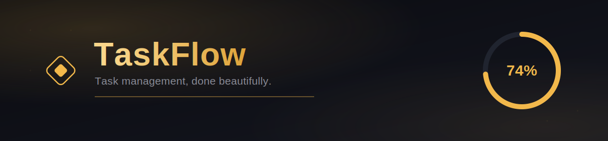
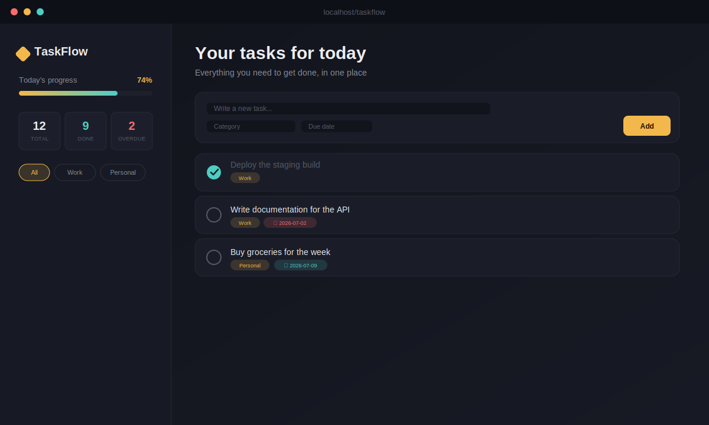

<div align="center">



<br/>


<br/>

**A dark, gold-accented task dashboard — built with PHP, MySQL & vanilla JS.**
No framework. No build step. Just clean code and a UI that actually looks like something.

<br/>



</div>

<br/>

## ◆ Table of Contents

- [Features](#-features)
- [Requirements](#-requirements)
- [Setup](#-setup)
- [Project Structure](#-project-structure)
- [Security](#-security)
- [License](#-license)

<br/>

## ◆ Features

<table>
<tr>
<td width="50%" valign="top">

**✦ Instant actions**
Add, complete, and delete tasks with zero page reloads — powered by a lightweight JSON API.

**✦ Categories**
Tag every task and filter your whole list down with a single click.

**✦ Due dates**
Cards flag themselves automatically the moment they go overdue.

</td>
<td width="50%" valign="top">

**✦ Live progress**
A gold progress bar and stat cards that update the instant something changes — no refresh needed.

**✦ Custom-built UI**
A dashboard theme designed from scratch — no CSS framework, no default template look.

**✦ Secure by default**
PDO + prepared statements everywhere, credentials never touch git.

</td>
</tr>
</table>

<br/>

## ◆ Requirements

- PHP 8.0+
- MySQL or MariaDB
- Any local server stack — XAMPP, WAMP, or Laragon all work fine

<br/>

## ◆ Setup

**1 · Clone the repo**
```bash
git clone https://github.com/YOUR_USERNAME/taskflow.git
cd taskflow
```

**2 · Create the database**

Run `schema.sql` against your MySQL server (via phpMyAdmin's SQL tab, or the CLI):
```bash
mysql -u root -p < schema.sql
```

**3 · Set up your local credentials**

`db.php` is intentionally **not** included in this repo — see [Security](#-security). Copy the example file and fill in your own values:
```bash
cp db.example.php db.php
```
```php
$host     = 'localhost';
$dbname   = 'todo_app';
$username = 'root';
$password = 'your_real_password';
```

**4 · Serve the project**

Drop the folder into your server's document root (e.g. `htdocs/taskflow` for XAMPP), then open:
```
http://localhost/taskflow/
```

<br/>

## ◆ Project Structure

```
taskflow/
├── assets/
│   ├── banner.svg       → README banner
│   └── preview.svg       → README preview mockup
├── index.php             → Main page (server-rendered)
├── api.php               → JSON API for add/toggle/delete
├── db.php                → Your local DB connection (gitignored, not in repo)
├── db.example.php         → Template for db.php — copy this one
├── schema.sql             → Database + table creation script
├── style.css              → Dashboard theme styles
├── script.js              → Client-side logic (AJAX + UI state)
└── .gitignore
```

<br/>

## ◆ Security

This repo is set up so you can push it publicly without leaking anything:

- `db.php` holds your real database credentials and is listed in `.gitignore` — it will **never** be committed.
- `db.example.php` is the safe, credential-free template that ships in the repo instead.
- Every query runs through **PDO prepared statements** — user input is never concatenated into SQL.

Before deploying anywhere public-facing, also make sure to:
- Use a strong, unique MySQL password — never `root` with an empty password in production.
- Restrict the MySQL user's privileges to just this database.
- Serve the app over HTTPS.

<br/>

## ◆ License

MIT — free to use, modify, and share.

<div align="center">
<br/>
<sub>◆ Built with PHP, MySQL, and a little bit of gold.</sub>
</div>
